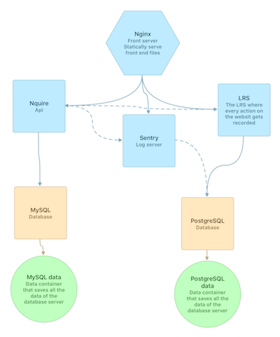

nQuire-it
=================

Fork
----
This project if forked from nQuire-it. Its aim is to provide integration with the [TinCan](https://tincanapi.com) standard to communicate learning records to a [LRS](https://tincanapi.com/learning-record-store/).

This has been made during my last year at [Télécom Bretagne](http://www.telecom-bretagne.eu/index.php?lang=en_GB) as a project.

I dockerized the project, added a few things like sending emails on another thread and sending the logs to a [Sentry](getsentry.com) instance and then worked on the integration of the TinCan standard using the library [jxapi](http://github.com/adlnet/jxapi).

The structure of the project is now the following:



The work on the app Sense-it will be published on a fork of the corresponding repo, but the main change will be to add the French translation, as all the changes about LRS communications will be on the API side.

Description
-----------

nQuire-it is a web application that allows users to create, manage and complete
scientific projects of their own interest. It is linked with Sense-it, an Android
app to collect data from Android device sensors.

* <http://www.nquire-it.org>


Requirements
------------

This app is build on Spring 4.0 and AngujarJS.
Other dependencies are listed in the file app/pom.xml

I18N
----

Updating the .PO files requires grunt.

```
npm install -g grunt-cli
npm install grunt --save-dev
npm install grunt-angular-gettext --save-dev
```

To add a new user-interface language, ensure that it is listed in:

* [`Gruntfile.js`][]
* [`static/src/js/app/app.js`][]

It will then need to be added to our Weblate translation server.

Licence
-------

nQuire-it is released under the GPLV3 licence. See the file 'gpl.txt' for more details.

Releases
--------

16-03-2014
Added support for:
 - uploading data from Sense-it.
 - user-defined plots.
 - custom fields in data table.


[`Gruntfile.js`]: https://github.com/IET-OU/nquire-web-source/blob/greek/Gruntfile.js#L40-L42
[`static/src/js/app/app.js`]: https://github.com/IET-OU/nquire-web-source/blob/greek/static/src/js/app/app.js#L219-L223
